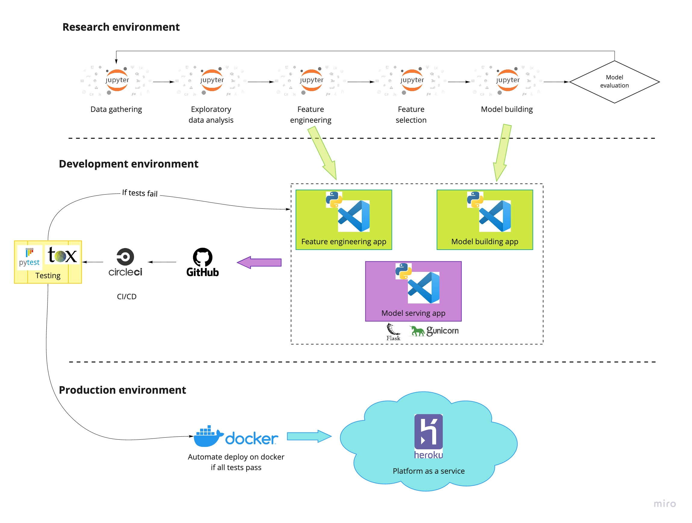

# Titanic classification project  
Hi there, welcome to my github's project for titanic classification. The following figure is the project architecture that is implemented in the project.  
  

  

## Project summary  
  
There are 3 main procedures in my projects.  
1. Research phase --> In this phase, the data is collected from kaggle. The model is built and optimize using feature engineering and feature selection.
2. Development phase --> The code in jupyter notebook is converted to .py app as it is needed to deploy in production. Pytest and tox module are implemented with Circle CI (CI/CD tool) to test the application before pushing to Github repo.
3. Production phase --> If all tests pass, the docker image which compose all necessary apps in the project is automated deploy to Heroku Paas with Circle CI.  
  
## Future works
* Monitoring and testing machine learning deployment on production is required. I plan to apply Grafana and prometheus to monitor the model and logging it using Kibana!  
* More powerful algorithm will be implemented, but we need to test it before deploying using Shadow mode!